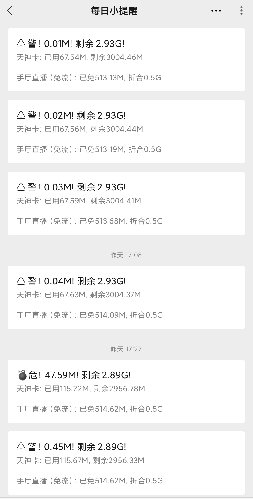

# 流量使用监控脚本

## 联通

### 功能实现

1. 监控套餐内流量使用情况，使用了通用流量即进行推送告警
2. 默认使用cookie参数进行查询，cookie失效会自动登录并保存登录后的cookie。
3. 免费流量只统计手厅直播免流（因为我只用到这个），有其它需要可联系作者优化。

### 使用
- 替换手机号，密码，appId即可
- 默认使用企业微信推送，需自行配置
- appId获取最方便的方法就是手机文件管理器，找到路径为 Unicom/appid 的文件打开复制。
- 默认是腾讯云函数配置，并打包好，云函数直接导入修改相应配置即可（因为需要保存cookie信息和上次的流量使用情况，所以需要有文件系统权限，具体可参考云函数文档配置）。
- 腾讯云函数触发器可选择每分钟查询一次，只在通用流量消耗之后会推送，由于使用官方查询接口，所以会有一定的延时。

